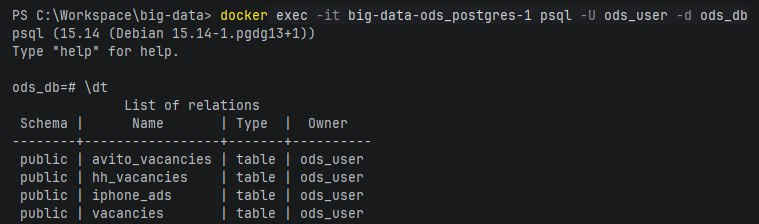
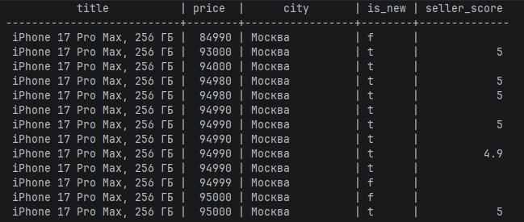
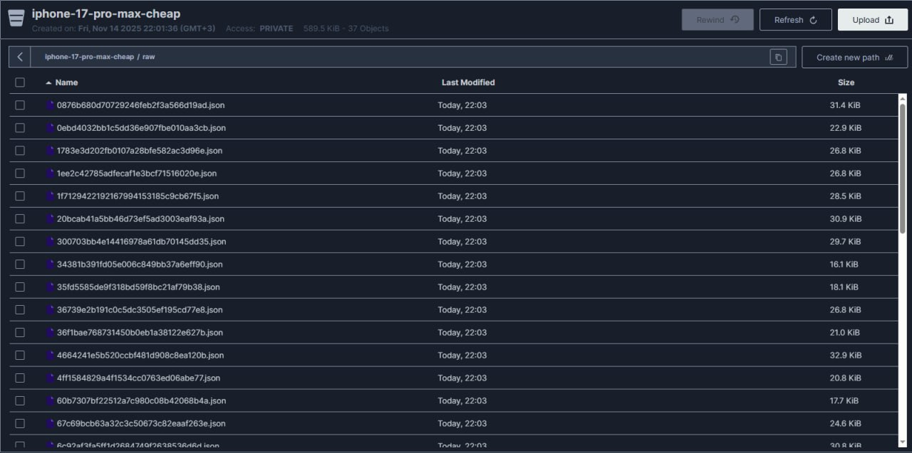
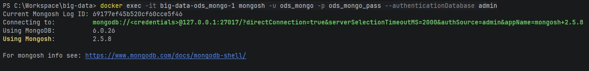
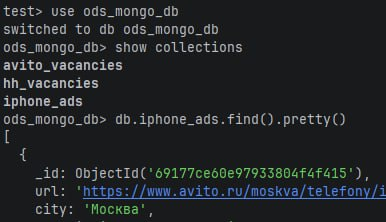
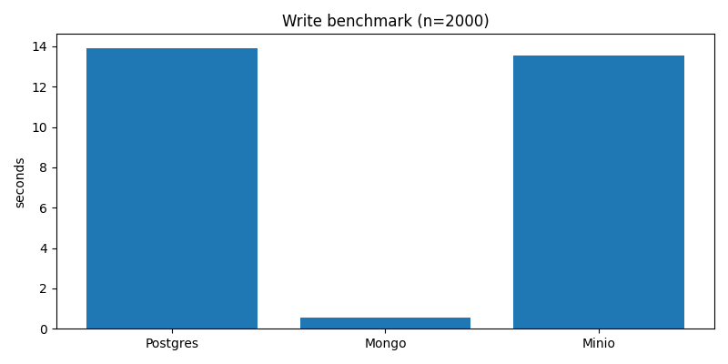
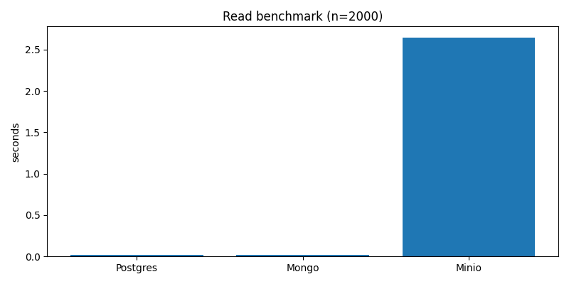
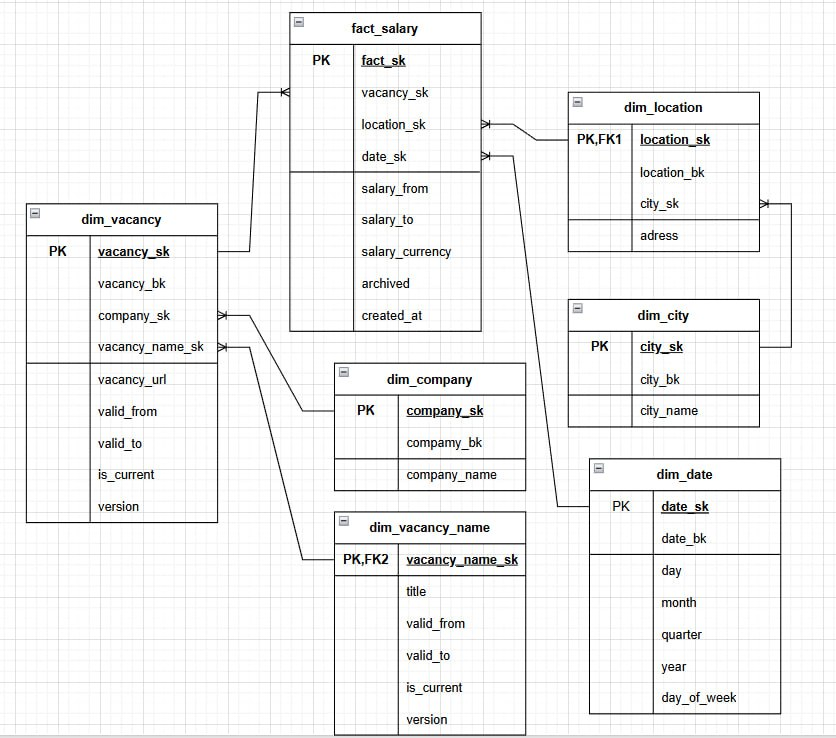

# Технологии хранения больших данных

**Выполнили:** Погрибняк Иван Сергеевич, Лапин Антон Владимирович  
**Источники данных:** Avito, hh.ru

---

## Лабораторная работа №1 "Работа с Airflow. ETL-процесс"

### Цель работы
Реализация ETL-процессов для сбора и загрузки данных о вакансиях и товарах в хранилище (слой ODS). Выбор и аргументация базы данных, оркестрация процессов с помощью Apache Airflow.

---

## Этапы выполнения

- [x] Развернуть сервис **Airflow** в Docker-контейнере с использованием docker-compose
- [x] Выбрать **3 различных сервиса для хранения данных**: PostgreSQL, MongoDB, MinIO (S3-совместимое хранилище)
- [x] Добавить конфигурацию для развертывания хранилищ в docker-compose
- [x] Реализовать **3 ETL-процесса** (DAG-ов) для Avito и hh.ru
- [x] Выгрузить данные во все выбранные базы данных
- [x] Провести **сравнительный анализ** хранилищ данных

---

## Отчёт

### Подготовка окружения

Перед началом реализации ETL-процессов была выполнена подготовка окружения:

1. **Создание рабочей директории** и настройка проекта
2. **Получение docker-compose.yaml** из официальной документации Airflow
3. **Настройка переменных окружения** в файле `.env`:
   - `AIRFLOW_USER`, `AIRFLOW_PASSWORD` - учетные данные администратора
   - `AIRFLOW_CONN_ODS_POSTGRES` - строка подключения к PostgreSQL
   - `AIRFLOW_CONN_ODS_MONGO` - строка подключения к MongoDB
4. **Добавление сервисов хранения данных** в docker-compose.yml:
   - **PostgreSQL** - реляционная БД для структурированных данных
   - **MongoDB** - документоориентированная БД для гибкого хранения
   - **MinIO** - S3-совместимое объектное хранилище для файлов и JSON
5. **Настройка volumes** для сохранения данных:
   - `postgres_data`, `mongo_data`, `minio_data`
6. **Инициализация Airflow** с помощью скрипта `init_airflow.sh`:
   - Инициализация БД Airflow
   - Создание администратора
   - Настройка подключений к хранилищам
7. **Запуск сервисов**: `docker-compose up -d`
8. **Веб-интерфейс Airflow** доступен по адресу: http://localhost:8080

### Инициализация структур данных

Перед запуском ETL-процессов был выполнен DAG `init_db` для создания необходимых структур:

- **PostgreSQL**: создание таблиц через `create_tables.sql`
- **MongoDB**: создание коллекций в БД `ods_mongo_db`
- **MinIO**: создание бакетов для разных типов данных

### Реализация ETL-процессов

Было разработано три DAG, каждый из которых реализует отдельный сценарий сбора данных.

#### DAG 1. iphone_17_pro_max_cheap_etl - мониторинг цен на технику Apple

**Цель:** отслеживание ценовых предложений на iPhone 17 Pro Max на платформе Avito в Москве и Санкт-Петербурге.

***Этапы ETL:***
- **Extract**: парсинг страниц Avito с помощью Selenium, сбор данных об объявлениях
- **Transform**: обработка данных - извлечение цены, локации, рейтинга продавца, статуса "новый"
- **Load**: загрузка в три целевых хранилища:
  - **PostgreSQL**: структурированные данные в таблицу `iphone_ads`
  - **MongoDB**: полные документы с raw HTML в коллекцию `iphone_ads`
  - **MinIO**: JSON-документы и изображения товаров

**Особенности:** 
- Обработка 20 объявлений из каждого города
- Сохранение изображений товаров в MinIO
- Ежедневное выполнение для отслеживания динамики цен

#### DAG 2. avito_vacancies_etl - сбор вакансий Data Engineer с Avito

**Цель:** сбор актуальных данных о вакансиях Data Engineer с платформы Avito для анализа рынка труда.

***Этапы ETL:***
- **Extract**: парсинг страниц поиска вакансий по запросу "Data Engineer"
- **Transform**: парсинг зарплаты (регулярные выражения), нормализация данных
- **Load**: загрузка в хранилища:
  - **PostgreSQL**: структурированные данные в таблицу `avito_vacancies`
  - **MongoDB**: полные документы с исходным HTML в коллекцию `avito_vacancies`
  - **MinIO**: JSON-документы с сырыми данными

**Особенности:**
- Сложный парсинг зарплатных вилок (от, до, тип)
- Обработка до 50 вакансий из каждого города
- Ежедневное обновление данных

#### DAG 3. hh_vacancies_etl - анализ вакансий Data Engineer с hh.ru

**Цель:** получение данных о вакансиях Data Engineer с HeadHunter через API для сравнения с данными Avito.

***Этапы ETL:***
- **Extract**: запросы к REST API hh.ru, получение структурированных данных
- **Transform**: нормализация данных зарплаты, работодателя, даты публикации
- **Load**: загрузка в хранилища:
  - **PostgreSQL**: структурированные данные в таблицу `hh_vacancies`
  - **MongoDB**: полные JSON-ответы API в коллекцию `hh_vacancies`
  - **MinIO**: сырые ответы API в виде JSON-файлов

**Особенности:**
- Использование официального API вместо парсинга
- Обработка зарплатных данных (from/to)
- Ежедневное обновление данных

### Демонстрация хранилищ данных

# PostgreSQL

# minIO

# Mongo

### Сравнительный анализ выбранных хранилищ данных

## Методология тестирования

Для сравнения производительности хранилищ данных был разработан тестовый DAG, выполняющий идентичные операции для PostgreSQL, MongoDB и MinIO.

**Тестовые данные:** 1000 записей о товарах с Avito и вакансиях с hh.ru  
**Критерии сравнения:** скорость записи, скорость чтения, аналитические возможности

## Результаты тестирования

### Производительность записи

**MongoDB** показала наилучшую производительность при массовой записи данных, что критически важно для ETL-процессов с регулярным обновлением информации.

### Производительность чтения

**PostgreSQL** демонстрирует хорошую скорость при выполнении сложных запросов с фильтрацией, в то время как **MongoDB** лидирует в простых операциях чтения.

## Анализ характеристик

### PostgreSQL
- **Сильные стороны:** Мощные аналитические возможности, транзакционность, SQL-запросы
- **Слабые стороны:** Жесткая схема данных, медленнее при массовой записи
- **Лучше для:** Структурированных данных вакансий, аналитических отчетов

### MongoDB  
- **Сильные стороны:** Гибкая документная модель, высокая производительность, простота масштабирования
- **Слабые стороны:** Ограниченные возможности для сложных JOIN-запросов
- **Лучше для:** Сырых данных парсинга, документов с изменяющейся структурой

### MinIO
- **Сильные стороны:** Максимальная гибкость хранения, отлично для файлов и больших объектов
- **Слабые стороны:** Нет встроенных запросов к данным, медленный доступ к отдельным полям
- **Лучше для:** Хранения изображений товаров, архивов сырых данных

## Итоговый выбор

Для ETL-процессов Avito и hh.ru рекомендуется использовать **MongoDB** как основное ODS-хранилище, поскольку оно обеспечивает:

- Высокую производительность записи для регулярных обновлений
- Гибкость схемы для данных с изменяющейся структурой  
- Достаточные аналитические возможности для большинства задач
- Простоту интеграции с Apache Airflow

**PostgreSQL** может использоваться для аналитических задач, требующих сложных SQL-запросов, а **MinIO** - для хранения файлов и архивов.

## Лабораторная работа №2 Лабораторная работа №2 “Нормализация данных. DataQuality.”

### Цель работы
Разработка базового аналитического хранилища данных на основе сырых данных из ЛР1. Формирование процессов очистки, трансформации и загрузки данных в слой DDS.

---

## Этапы выполнения

- [x] Определить структуру хранилища: схема "звезда" или "снежинка". Привести данные к 3НФ.
- [x] Создать новые DAG в Airflow для трансформации данных:
- [x] Где возможно, сущности должны соответствовать концепции медленно изменяющихся измерений (SCD), чтобы изменения значений атрибутов сущностей могли отслеживаться во времени
- [x] Построение зависимостей между ETL-процессами. Процессы детального слоя должны ожидать завершения соответствующих расчетов исходных данных. Для реализации зависимостей возможно использовать сенсоры (https://airflow.apache.org/docs/apache-airflow/stable/core-concepts/sensors.html). Альтернативные варианты приветствуются.
- [x] Data Quality: реализовать DAG для проверки качества данных.

---

## Отчёт

В ЛР1 были реализованы три DAGа на основе API hh.ru, API trudvsem и на основе авито:
- `etl1` — вакансии data science с биржи по поиску работы trudvsem.
- `etl2` — вакансии data science с агрегатора объявлений Avito.
- `etl3` — вакансии data science с hh.ru

Все данные загружались в ODS в Postgres в виде таблиц: 
- ods_trudvsem_vacancies
- ods_hh_vacancies
- ods_avito_vacancies)
Для ЛР2 используются таблица ods_hh_vacancies. На их основе строятся следующие dds таблицы:
- dim_source             - справочник источников вакансий.
Содержит список источников данных (ТрудВсем, HeadHunter, Avito).
- dim_region             - историзированный справочник регионов
Хранит географическую иерархию регионов с поддержкой истории изменений.
- dim_company            -  историзированный справочник компаний
Хранит информацию о компаниях-работодателях с историей изменения их данных.
- dim_vacancy_category   - иерархический справочник категорий
Определяет категории IT-вакансий (Data Science, Analytics и др.) с возможностью вложенности.
- fact_vacancies         - основная таблица вакансий
Содержит агрегированные и очищенные данные по всем вакансиям, связанные с измерениями.

### Выбор модели данных
Для построения аналитического слоя DDS мы выбрали схему «Снежинка» по следующим причинам:

**1 Для хранения истории изменений:**  Снежинка позволяет эффективно отслеживать историю переименований вакансий через нормализованную таблицу dim_vacancy_name, что критически важно для анализа эволюции позиций на рынке труда.
**2 Для устранения избыточности данных:**  Нормализация географических данных (город → локации) через отдельную таблицу dim_city предотвращает дублирование названий городов и обеспечивает консистентность географических справочников.
**3 Для поддержки бизнес-логики:**  Иерархическая структура снежинки отражает реальные бизнес-отношения — одна вакансия может менять название, оставаясь той же позицией; локации естественным образом относятся к городам, а не существуют независимо.
**4 Для гибкости аналитики:**  Снежинка позволяет более глубоко анализировать данные — например, отслеживать, как часто компании меняют названия вакансий, или сравнивать распределение зарплат по городам с детализацией до конкретных станций метро.
**5 Для экономии ресурсов:**  Хотя снежинка требует больше JOIN-операций, она существенно экономит дисковое пространство за счет устранения дублирования данных в измерениях, что актуально при больших объемах информации о вакансиях.

Снежинка обеспечивает оптимальный баланс между нормализованной гибкостью данных и производительностью запросов, что соответствует аналитическим потребностям HR-аналитики.

### Нормализация до 3НФ

#### 1НФ: Все атрибуты атомарны
- В dim_date дата разложена на атомарные компоненты: day, month, quarter, year, day_of_week
- В dim_vacancy_name название вакансии (title) представлено как единое текстовое значение без составных частей
- Географические данные разделены: city_name в dim_city, address в dim_location

#### 2НФ: Устранены частичные зависимости
- В fact_salary с составным ключом (vacancy_sk, location_sk, date_sk) все атрибуты (salary_from, salary_to, salary_currency) зависят от полного составного ключа
- В dim_location атрибуты metro_station, address зависят от всего первичного ключа location_sk, а не от его части
- В dim_vacancy все атрибуты (vacancy_url, valid_from, valid_to) зависят от всего ключа vacancy_sk

#### 3НФ: Устранены транзитивные зависимости
- Географические данные: Вместо хранения city_name в каждой записи dim_location, создана отдельная таблица dim_city. Теперь зависимость location_sk → city_sk → city_name разорвана, и city_name зависит только от city_sk
- Названия вакансий: Информация о названиях вакансий с историей изменений вынесена в dim_vacancy_name, устранена транзитивная зависимость vacancy_sk → vacancy_name_sk → title
- Компании: Данные о компаниях хранятся в dim_company, а не дублируются в каждой вакансии. Устранена зависимость vacancy_sk → company_sk → company_name
- Временные данные: В dim_date все временные компоненты (day, month, year) зависят только от date_sk, а не друг от друга

#### Конкретные примеры устранения дублирования:
- Города: Даже при наличии нескольких локаций в одном городе (например, "Москва, м. Белорусская" и "Москва, м. Китай-город") информация о городе хранится один раз в dim_city
- Компании: Одна компания с тысячами вакансий хранит свое название только в dim_company, а не повторяется в каждой записи fact_salary
- Названия вакансий: При изменении названия вакансии (например, "Data Scientist" → "ML Engineer") создается новая запись в dim_vacancy_name без дублирования истории в основной таблице
- Даты: Каждая календарная дата с декомпозицией на компоненты хранится один раз в dim_date и может использоваться в тысячах фактовых записей

### Управление зависимостями между ETL-процессами
Для обеспечения корректной последовательности выполнения этапов загрузки данных из HH.ru были разработаны три координирующих DAG с комбинированным подходом.

**1 DAG etl_orchestrator.py** - центральный координатор
Линейная реализация с TriggerDagRunOperator для последовательного запуска:
Инициирует ежедневный ETL-процесс по расписанию @daily
Последовательно запускает: ODS → DDS → Data Quality
Гарантирует очередность через wait_for_completion=True

**2 DAG ods_hh_etl.py** - загрузка сырых данных
Параллельная загрузка вакансий из HH.ru API:
Извлечение данных по запросу "data engineer" из 7 городов России
Сохранение необработанных данных с полной структурой JSON
max_active_runs=1 для избежания rate limits API

**3 DAG dds_hh_etl.py** - трансформация в аналитическую схему
Интеллектуальный потребитель с ExternalTaskSensor:
Ожидает завершения ODS через ExternalTaskSensor с режимом reschedule
Строит нормализованную снежинку из сырых данных
Поддерживает SCD Type 2 для названий вакансий
Использует MD5 хеши для генерации бизнес-ключей

### Преимущества подхода:
**Двойная защита:** Координатор гарантирует последовательность, сенсоры перестраховывают
**Эффективность:** Параллельная загрузка по городам, reschedule для ожидания
**Надежность:** Автоматические retry, сохранение raw-данных для аудита
**Бизнес-логика:** Классификация вакансий, нормализация географии, поддержка истории
**Гарантии выполнения:**
- DDS никогда не запускается на неполных ODS-данных
- Каждый этап имеет четкую зону ответственности
- Полный суточный цикл обработки с автоматическим восстановлением

Архитектура обеспечивает надежную ежедневную загрузку данных о вакансиях Data Engineer в нормализованную аналитическую схему, готовую для анализа рынка труда.

